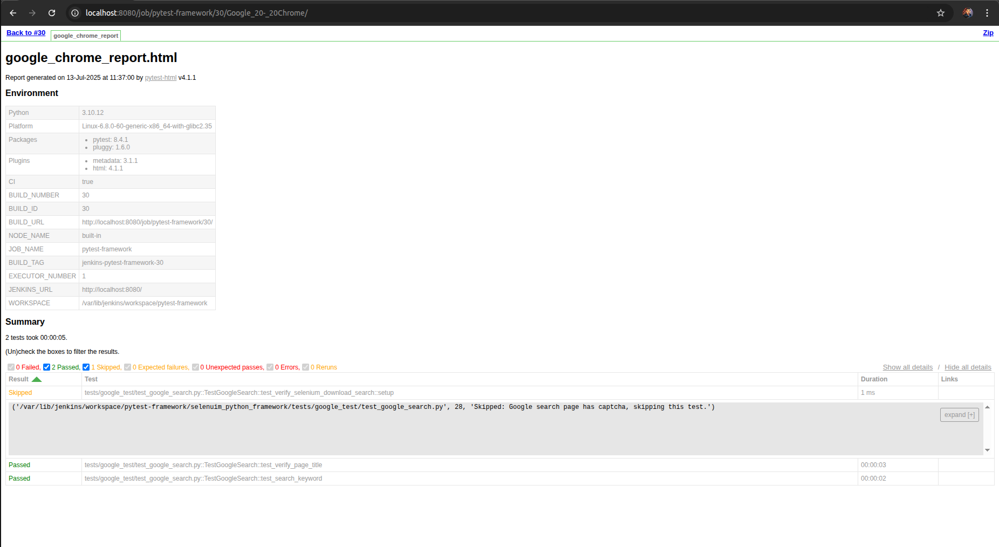
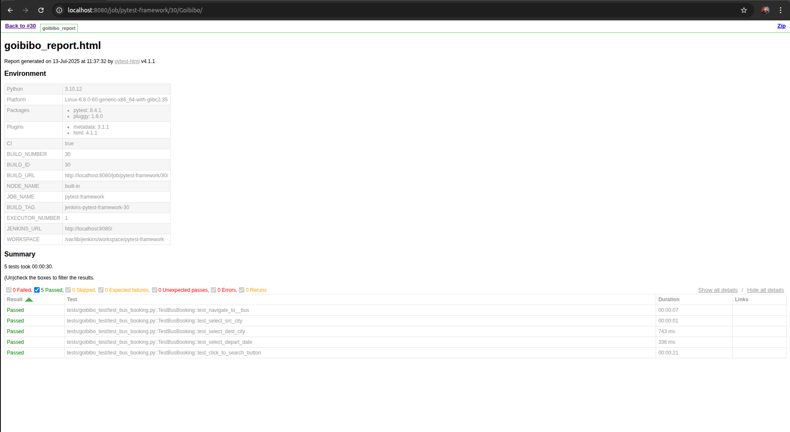

# Selenium-Python-Pytest UI Framework

A scalable and modular Selenium automation framework built using Python and Pytest, designed to support multi-browser testing, reporting, and CI/CD integration via Jenkins.

## 🔧 Tech Stack

- **Language**: Python 3.10+
- **Automation Tool**: Selenium WebDriver
- **Test Framework**: Pytest
- **Reporting**: pytest-html
- **CI/CD**: Jenkins
- **Version Control**: Git/GitHub

---

## 📁 Project Structure
```
pytest_learning/
├── selenuim_python_framework/
│ ├── common/           # Constants, config paths selenium library
│ ├── pages/            # Page Object classes (e.g., HomePage, SearchPage)
│ ├── config/           # configurations (browser, environment)
│ ├── temp/             # Reports, screenshots, zip output
│ ├── utils/            # Custom utilities (driver, logger, config, locator)
│ ├── tests/
│ │ ├── goibibo_test/   # Tests and conftest for Goibibo
│ │ ├── google_test/    # Tests and conftest for Google
│ └── conftest.py       # Shared fixtures, hooks, reporting
├── requirements.txt
├── pytest.ini
└── Jenkinsfile         # Jenkins pipeline configuration
```

## ✅ Setup Instructions

### 1. Clone the Repository

```bash
git clone git@github.com:rohitratnakumar09/pytest_learning.git
cd pytest_learning/selenuim_python_framework
```
2. Create Virtual Environment
```bash
python3 -m venv venv
source venv/bin/activate
```

3. Install Dependencies
```bash
pip install -r requirements.txt
```
🧪 Run Tests
Run All Tests (Chrome by default)
```bash
pytest --html=temp/report.html
```


Run Specific Suite
```bash
pytest tests/goibibo_test/ --browser=chrome --html=temp/goibibo.html
pytest tests/google_test/ --browser=firefox --html=temp/google_firefox.html
pytest tests/google_test/ --browser=dockerfirefox --html=temp/docker_firefox.html
pytest tests/google_test/ --browser=dockerchrome --html=temp/docker_chrome.html
```
⚙️ Run in Jenkins
Use the provided Jenkinsfile for pipeline configuration:

```bash
pipeline {
  agent any
  stages {
    ...
  }
  post {
    always {
      publishHTML([...])
    }
  }
}
```

Make sure to:

Add SSH credentials for GitHub

Install HTML Publisher plugin

Setup Python, Chrome/GeckoDriver in Jenkins environment

## 📸 Screenshots

### ✅ Test Report Sample (pytest-html)





### 🧪 Sample Screenshot on Failure


### 📁 Jenkins Console Output


## Contributing

Contributions are welcome! Fork the repository, make changes, and submit pull requests.

## License

This project is licensed under the MIT License.
```

This complete README.md file includes all the sections you requested, providing users with a comprehensive guide to understanding and using the Python Selenium pytest framework.
